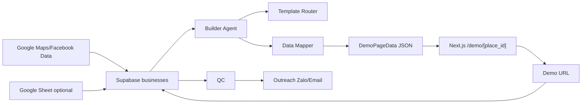

# System Architecture

## Thành phần hệ thống
| Thành phần | Vai trò |
|---|---|
| Supabase Postgres | Lưu lead, trạng thái demo, trạng thái outreach |
| Google Sheet | Nguồn nhập hoặc kiểm duyệt batch nhẹ |
| Builder Agent | Chọn template, map dữ liệu, tạo demo URL, cập nhật status |
| Next.js App | Render route `/demo/[place_id]` |
| Template Components | Bộ component dùng chung cho 15 ngành |
| Vercel | Hosting, preview, production deployment |
| Outreach Worker | Gửi Zalo/email sau khi demo đạt QC |

## Sơ đồ luồng dữ liệu


## Kiến trúc render
Next.js không cần tạo file HTML vật lý cho từng doanh nghiệp trong MVP. Route động `/demo/[place_id]` fetch dữ liệu từ Supabase, chuyển thành `DemoPageData`, chọn template component và render.

```ts
// pseudo-code
const business = await getBusinessByPlaceId(placeId)
const templateKey = business.template_key ?? routeTemplateByIndustry(business.industry)
const demoData = buildDemoPageData(business, templateKey)
return <DemoTemplateRenderer templateKey={templateKey} data={demoData} />
```

## Quy tắc mở rộng ngành
Khi thêm ngành mới:
1. Thêm `template_key`.
2. Thêm mapping `industry_aliases`.
3. Tạo spec trong `/docs/04-templates`.
4. Tạo prompt Stitch AI.
5. Tạo prompt Studio AI.
6. Thêm service defaults và fallback copy.
7. Đăng ký template trong `templateRegistry`.

## Trạng thái quan trọng
| Field | Giá trị đề xuất | Ý nghĩa |
|---|---|---|
| `status` | `new`, `qualified`, `rejected` | Trạng thái lead tổng |
| `demo_status` | `pending`, `generating`, `ready`, `failed`, `approved`, `sent` | Trạng thái demo |
| `outreach_status` | `not_sent`, `queued`, `sent`, `replied`, `bounced`, `do_not_contact` | Trạng thái gửi khách |

## Nguyên tắc bảo mật
- Không expose Supabase service role key trên client.
- Route demo chỉ đọc các field cần render.
- Không ghi đè dữ liệu gốc từ Google/Facebook khi build demo.
- Log lỗi ở bảng riêng hoặc field `notes`, không ghi lỗi vào nội dung hiển thị cho khách.
