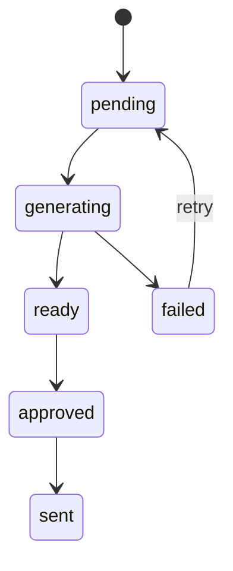

# Status Workflow

## Lead status
| Status | Ý nghĩa |
|---|---|
| `new` | Lead mới import |
| `qualified` | Đủ điều kiện tạo demo |
| `rejected` | Không xử lý |

## Demo status
| Status | Khi nào dùng |
|---|---|
| `pending` | Chờ tạo demo |
| `generating` | Agent đang xử lý |
| `ready` | Demo render được |
| `failed` | Lỗi không retry tự động |
| `approved` | Đã QC, sẵn sàng gửi |
| `sent` | Đã gửi demo cho khách |

## Outreach status
| Status | Ý nghĩa |
|---|---|
| `not_sent` | Chưa gửi |
| `queued` | Đang chờ gửi |
| `sent` | Đã gửi |
| `replied` | Khách phản hồi |
| `bounced` | Email lỗi hoặc Zalo không gửi được |
| `do_not_contact` | Không liên hệ nữa |

## Transition hợp lệ


## Ghi chú lỗi
`notes` nên có timestamp:
```txt
2026-07-07T10:30:00Z [demo failed] Unknown industry: pet grooming
```
