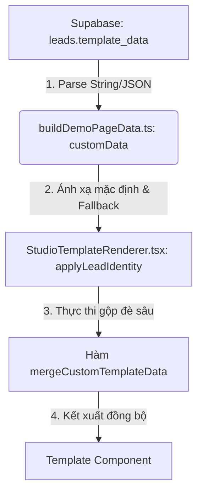

# Source Of Truth - Demo Renderer Rules

Cập nhật: 2026-08-07.

Demo renderer là phần render website demo public theo `place_id`. Route `/demo/[place_id]` phải hiện trực tiếp landing page của doanh nghiệp, không hiện dashboard hay màn hình cấu hình.

## Mục tiêu

Khi truy cập:

```txt
/demo/{place_id}
```

Hệ thống phải:

1. Lấy `place_id` từ URL.
2. Gọi `getBusinessByPlaceId(place_id)` để fetch từ Supabase table `leads`.
3. Nếu không tìm thấy lead hoặc là mock URL, fallback sang `getMockLeadByPlaceId(place_id)`.
4. Chọn template bằng `routeTemplateByIndustry(lead.industry)`.
5. Build `DemoPageData` bằng `buildDemoPageData` (tự động phân tích cú pháp cột JSON `template_data` nếu có).
6. Áp dụng đè dữ liệu động qua hàm ghép lồng sâu `mergeCustomTemplateData` ở `StudioTemplateRenderer.tsx`.
7. Render template qua `DemoTemplateRenderer` và `StudioTemplateRenderer`.

## Không được tạo trong route demo

- Dashboard.
- Playground.
- Form nhập tên doanh nghiệp.
- Form chọn doanh nghiệp mẫu.
- Live editor.
- Preset launcher.
- UI cấu hình dữ liệu.

## File chính

| File | Vai trò |
|---|---|
| `src/app/demo/[place_id]/page.tsx` | Fetch lead, build data, render template |
| `src/app/demo/[place_id]/not-found.tsx` | Trang fallback khi không có lead |
| `src/lib/supabase/server.ts` | Fetch Supabase REST API |
| `src/lib/demo/buildDemoPageData.ts` | Map lead thành `DemoPageData` (chứa logic parse JSON `template_data` và chuyển đổi chế độ Blueprint cho Mock) |
| `src/lib/demo/mockDemoData.ts` | Mock data cho 15 ngành |
| `src/lib/demo/templateRouter.ts` | Chọn template theo industry |
| `src/lib/demo/templateDefaults.ts` | Fallback text, service, image theo ngành |
| `src/components/demo/DemoTemplateRenderer.tsx` | Renderer entry |
| `src/components/demo/StudioTemplateRenderer.tsx` | Đóng vai trò bộ định hình (Adapter), thực thi ghép đè JSON nâng cao và registry 15 template thực tế |
| `src/template-sources/{industry}` | Source template đã import từ Studio AI |

## Supabase table

Tên bảng hiện tại:

```txt
leads
```

Field quan trọng (cũ & mới bổ sung):

| Field | Kiểu dữ liệu | Vai trò |
|---|---|---|
| `id` | `uuid` | ID nội bộ Supabase |
| `place_id` | `text` | Route `/demo/[place_id]` |
| `industry` | `text` | Chọn template tương ứng |
| `name` | `text` | Tên doanh nghiệp hiển thị mặc định |
| `formatted_address` | `text` | Địa chỉ doanh nghiệp |
| `formatted_phone_number` | `text` | Số điện thoại dùng cho hotline/zalo CTA |
| `image_url` | `text` | Ảnh bìa lớn mặc định (Hero image) |
| `rating` | `numeric` | Điểm đánh giá (ví dụ: 4.8) |
| `user_ratings_total` | `int` | Số lượng lượt đánh giá hiển thị |
| `logo_url` | `text` | Cột ghi đè link Logo thương hiệu riêng biệt |
| `about_image_url` | `text` | Cột ghi đè link ảnh phần Giới thiệu (About section) |
| `gallery_urls` | `text[]` | Mảng chứa danh sách ảnh bộ sưu tập |
| `template_data` | `jsonb` | **JSON cấu hình tùy biến động**. Ghi đè toàn bộ chữ/ảnh trên giao diện |

---

## Cơ chế tùy biến bằng `template_data` JSON (JSON Override Pipeline)

### 1. Dòng chảy dữ liệu (Architecture Pipeline)
Khi một lead được truy cập, dữ liệu đi qua luồng sau:



*   **Bước 1**: `buildDemoPageData.ts` lấy trường `template_data` từ database, tự động phân tích cú pháp (parse) chuỗi JSON an toàn và đưa vào đối tượng `leadData.template.customData`.
*   **Bước 2**: Hệ thống gán các thông tin cơ bản từ các cột database riêng lẻ (tên, điện thoại, địa chỉ) vào cấu trúc `baseData` của trang.
*   **Bước 3**: Hàm `mergeCustomTemplateData` duyệt qua tất cả các cặp Key-Value trong `customData` để tiến hành ghi đè sâu.

### 2. Thuật toán gộp đè lồng sâu (Dot Notation)
Hàm `mergeCustomTemplateData` hỗ trợ ghi đè bất kỳ thuộc tính nào bằng cơ chế dấu chấm (Dot Notation):
*   **Thuộc tính phẳng**: Khóa không chứa dấu chấm (ví dụ: `"logo_url"`, `"hero_image"`) sẽ ghi đè trực tiếp thuộc tính ở gốc của `baseData`.
*   **Thuộc tính lồng sâu (Dot Notation)**: Khóa chứa dấu chấm (ví dụ: `"hero.title"`, `"about.body"`, `"contact.phone"`) sẽ được tách nhỏ theo dấu chấm `.` để tạo ra đường dẫn đối tượng, truy cập sâu vào bên trong và thay đổi giá trị.
    *   *Ví dụ*: `"about.title": "Lời chào từ chúng tôi"` sẽ đi tìm `baseData.about.title` và thay thế nó.
*   **Mảng danh sách động**: Các mảng như `"services"`, `"reviews"`, `"gallery"` khi được khai báo trong JSON sẽ ghi đè và thay thế hoàn toàn mảng cũ để admin dễ dàng tái cấu trúc dịch vụ/đánh giá.

---

## Chế độ Bản đồ khóa trực quan (Visual Blueprint Mode) cho Preview

Khi truy cập trang xem thử mẫu qua đường dẫn `/demo/mock-{industry_key}`:
1.  Hệ thống kích hoạt cờ hiệu `isMockPreview`.
2.  Bỏ qua toàn bộ dữ liệu thật của lead và dữ liệu mockup y khoa/spa.
3.  **Tất cả các đoạn chữ và nút bấm** trên màn hình sẽ hiển thị trực tiếp tên khóa JSON nằm trong dấu ngoặc vuông (ví dụ: `[hero.title]`, `[about.badge]`, `[contact.phone]`).
4.  **Tất cả các hình ảnh** được thay thế bằng ảnh placeholder màu xanh của `https://placehold.co/` có in rõ nhãn khóa tương ứng (ví dụ: `[logo_url]`, `[hero_image]`, `[gallery_urls[0]]`).
5.  **Mục đích**: Giúp quản trị viên có thể xem trực quan giao diện thực tế và biết ngay khóa nào điều chỉnh khối thông tin nào để viết cấu hình JSON chính xác tuyệt đối mà không cần đọc code.

---

## Chuẩn hóa tương thích kép (Dual-compatibility)

Để các template từ các nguồn khác nhau không bị lỗi sập trang (crash), bộ adapter `StudioTemplateRenderer` thực hiện chuẩn hóa:
*   **Gallery**: Map cả dạng ảnh phẳng `{ src, alt }` và dạng lồng `{ image: { src, alt } }`. Điều này đảm bảo không gây ra lỗi `Cannot read properties of undefined (reading 'src')` trên template Nha khoa.
*   **Reviews**: Map cả dạng phẳng `{ author, text }` và dạng lồng `{ author, quote }` để tương thích với template Thiết kế nội thất.

---

## Chuẩn hóa dữ liệu nâng cao (Slideshow, Nút CTA & Trust)

Hệ thống tự động đồng bộ hóa và làm sạch cấu hình đầu vào trong `mergeCustomTemplateData` để đảm bảo độ tin cậy:
1.  **Slideshow 3 giây cho Hero**:
    *   Sử dụng trường `"hero_images"` trong JSON `template_data` để định nghĩa một danh sách các ảnh nền.
    *   Hệ thống sẽ render slideshow ảnh tự động chuyển sau mỗi 3 giây.
    *   Nếu mảng `"hero_images"` trống hoặc bị xóa, hệ thống sẽ tự động dùng ảnh mặc định của template.
2.  **Đồng bộ Nút bấm CTA (CTA Action Mapping)**:
    *   Tự động đồng bộ các khóa CTA giữa định dạng Studio (`primaryCta` / `secondaryCta`) sang định dạng Stitch (`primaryAction` / `secondaryAction`) và ngược lại. Điều này giúp admin cấu hình phím tắt nút bấm mà không sợ sai lệch cú pháp của từng template.
3.  **Chuẩn hóa chỉ số đánh giá (Trust Property Normalization)**:
    *   Hỗ trợ tự động chuyển đổi các giá trị thô (`trust.rating`, `trust.reviewCount`, `trust.followers`) kiểu số hoặc chuỗi đơn thành đối tượng lồng sâu tương ứng cho các phần tử UI của template (ví dụ: `{ score: "4.9/5", label: "..." }`), triệt tiêu hoàn toàn lỗi crash trang do sai lệch kiểu dữ liệu đầu vào.

---

## Checklist khi sửa demo renderer

- [ ] `/demo/mock-nha_khoa` và `/demo/mock-spa` chạy bình thường và hiển thị đúng nhãn khóa Blueprint.
- [ ] Truy cập lead thật hiển thị đúng thông tin và ảnh thật.
- [ ] Ghi đè JSON qua cột `template_data` hoạt động ổn định và chính xác trên môi trường thật.
- [ ] Chạy kiểm tra kiểu `npx tsc --noEmit` thành công.
- [ ] Chạy kiểm tra đóng gói `npm run build` thành công.
